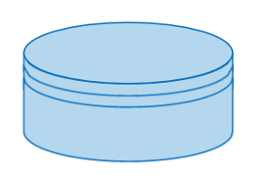
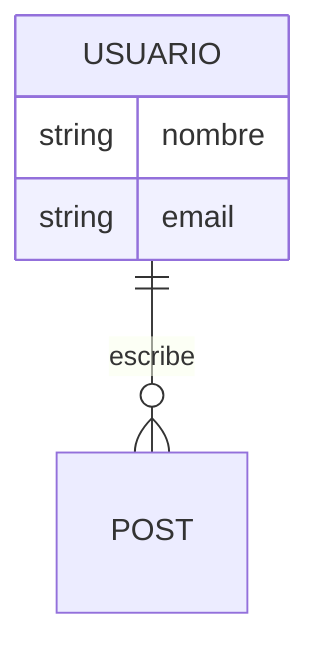

## Algoritmos

Se­cue­n­cias pre­de­fi­ni­das y finitas de acciones uti­li­za­das para resolver problemas

Se utilizan para realizar tareas es­pe­cí­fi­cas uti­li­za­n­do se­cue­n­cias fijas de pasos o co­n­vi­r­tie­n­do valores de entrada en valores de salida. Los pasos están pre­de­te­r­mi­na­dos y se ejecutan en una secuencia

Un algoritmo sirve como una secuencia lógica pre­de­fi­ni­da de acciones para obtener valores de salida definidos a partir de ciertos valores de entrada

__Propiedades que debe tener un algoritmo__

+ Si­n­gu­la­ri­dad/eficacia
Cada paso de la secuencia de acciones de un algoritmo debe ser eficaz e ine­quí­vo­co. Esto significa que, para obtener un resultado o valor de salida, cada in­s­tru­c­ción debe tener sentido y ser adecuada para su fin.

+ Ejecución
Las acciones y los pasos in­di­vi­dua­les deben ser eje­cu­ta­bles y lógicos.

+ Finitud
El objetivo de un algoritmo es convertir los datos de entrada en datos de salida. Esto solo es posible si el proceso es finito. Los al­go­ri­t­mos deben tener una forma finita, por ejemplo, mediante un número limitado de ca­ra­c­te­res o una memoria limitada.

+ Te­r­mi­na­ción
Los pasos in­di­vi­dua­les eje­cu­ta­bles, lógicos y finitos deben conducir a un resultado en un tiempo finito. La secuencia debe estar dirigida a un objetivo y no terminar en un bucle sin fin y sin resultado.

+ De­te­r­mi­na­ción
Las mismas entradas en las mismas co­n­di­cio­nes deben conducir a los mismos re­su­l­ta­dos. Solo así los al­go­ri­t­mos pueden ga­ra­n­ti­zar que una apli­ca­ción y la solución de un problema funcionen de forma fiable.

+ De­te­r­mi­ni­s­mo
En la secuencia de pasos del algoritmo, siempre hay una única forma de resolver el problema. Así, los pasos po­s­te­rio­res están cla­ra­me­n­te definidos por los re­su­l­ta­dos in­te­r­me­dios y no son alea­to­rios.

## Diagrama de flujo(flow chart)

Un diagrama de flujo es un diagrama que describe un proceso, sistema o algoritmo informático. 

Se usan para documentar, estudiar, planificar, mejorar y comunicar procesos que suelen ser complejos en diagramas claros y fáciles de comprender.

+ Identificación de pasos especficos´.
+ Simplificación de información compleja.
+ Comnucación más rápida.

### Simbología
+ ``Terminador/Terminal``(Terminator): Puntos de inicio o fin o resultados potenciales.  

+ ``Simbolo de proceso``(Process): Representa un proceso acción o función.  

+ ``Rombo de decisiones``(Decision): Toma de decisiones o evaluación de condición.  

+ ``Simbolo de demora``(delay): Transcurso de tiempo durante un proceso.  

+ ``Simbolo de documento``(Document): Entrada o salida de un documento.  

+ ``Datos``(Data): De entrada o salida.  

+ ``Base de datos``(Data base):  
 
+ ``Símbolo del conector``(connector): El flujo continua donde hay un simbolo idéntico que contiene la misma letra.  

+ ``Enlace fuera de página``(Off-Page link): Conecta diagramas.  

+ ``Conectores``: Indican la dirección o secuencia de un proceso.
+ ``Carriles de proceso``: En ellos se ubican el resto para determinar procesos concretos o responsabilidades.

### Metodología

+ Definir proposito y alcance.
+ Identificación de tareas.
+ Clasifación de tareas(aplicación de simbología).
+ Dibujar diagrama.
+ Confirmar diagrama.
### Diagramas para la programación

__Funciones:__

+ Demostrar cómo el código está organizado.
+ Visualizar la ejecución de un código dentro de un programa.
+ Mostrar la estructura de un sitio web o aplicación.
+ Comprender cómo los usuarios navegan por un sitio web o programa.

__Siempre contienen__

+ Lenguaje unificado de modelado (UML): este es el lenguaje de propósito general usado en la ingeniería de software para el modelado.
+ Diagramas Nassi-Shneiderman (NSD): usados para la programación informática estructurada. También se denominan "estructogramas".
+ Diagramas DRAKON: lenguaje de programación visual de algoritmos empleado para crear diagramas de flujo.

__Tipos__

+ Diagrama de flujo de datos (DFD): traza el flujo de información de cualquier sistema o proceso.

## Sitemap

¿Qué es un sitemap?  
Un sitemap es un mapa de la página web que ayuda a organizar el contenido para facilitar la navegación a los usuarios y a los motores de búsqueda.
  
``Un sitemap visual`` es una herramienta que describe la estructura del contenido, las páginas de un sitio web y sus interconexiones en un formato gráfico.

``Un sitemap XML`` es un archivo legible por máquina que enumera las URL de un sitio web para los rastreadores de los motores de búsqueda.

Es una herramienta esencial para la planificación y el desarrollo de un sitio web. Ayuda a diseñadores, desarrolladores y propietarios de sitios web a:

+ Comprender la arquitectura del sitio web
+ Identificar posibles problemas
+ Planificar el contenido de forma más eficaz
+ Garantizar que el sitio web esté organizado, sea fácil de usar y esté optimizado para los motores de búsqueda.
+ Asegurarse de que todas las páginas están conectadas de forma lógica y son fáciles de navegar.
+ Mejorar la experiencia de usuario en el sitio web.
+ Asignar y realizar un seguimiento de las tareas de desarrollo web.
+ Mejorar la categorización de productos
+ Planificación de contenidos y inspiración para la creación de nuevos.
+ Optimización SEO.

Si la web está en funcionamiento, un sitemap puede ser útil para planificar la estrategia de contenidos.  
Al trazar un mapa de sus páginas y entradas, se puede identificar las lagunas en el contenido y asegurarse de cubrir todos los temas deseados.

También se puede usar para reorganizar un sitio web o añadir nuevas secciones, para ver cómo encaja todo y realizar cambios sin alterar la estructura general del sitio.

### Pasos de creación

__Paso 1: Definir los objetivos y el alcance del sitio web o del proyecto__  

Definir las metas y los objetivos del sitio web identificando: 

+ El público objetivo.
+ Los tipos de contenido.
+ Las características que desea tener.

Para definir el alcance del sitio web :

+ Realizar estudios de mercado
+ Analizar a la competencia
+ Identificar las necesidades de los usuarios

__Paso 2: Identificar las principales secciones y páginas de tu sitio web__  

Identificar las principales secciones y páginas de tu sitio web:
+ Crear una lista de todas las páginas y secciones que deseas incluir.
+ Agrupar las páginas relacionadas.
+ Crear una jerarquía que refleje la importancia de cada página.

Para identificar las secciones y páginas principales de tu sitio web :

+ Crear un mapa mental
+ Realizar una auditoría de contenidos
+ Analizar el comportamiento de los usuarios
+ Identificar categorías de contenido

__Paso 3: Utilizar una plantilla o herramienta de mapa web__  

Se puede usar una plantilla de sitemap ya creada para agilizar el proceso.

Proporciona una estructura y un diseño básicos para el sitemap, así como,  las herramientas de mapa del sitio.

Utilizar una puede ahorrarte tiempo y garantizar que tu mapa web sea fácil de navegar y actualizar según sea necesario.

__Paso 5: Crear conexiones y relaciones entre páginas__

El flujo de tu sitio web debe permitir a los usuarios pasar de una página a otra sin perderse ni confundirse.

+ Identifica las rutas de navegación principales: Son las conexiones más importantes entre páginas y deben ser fáciles de encontrar para los usuarios. 
+ Crear conexiones menos críticas entre páginas, asegurándote de que sean lógicas y relevantes.

__Paso 6: Revisar y perfeccionar el sitemap__

Revisarlo y perfeccionarlo para asegurarse de que refleja con precisión los objetivos y el alcance de su sitio web, así como proporcionar una hoja de ruta clara para el proceso de diseño y desarrollo.

Para ello obtene comentarios sobre el sitemap compartiendolo con otras personas y preguntate:

+ ¿Representa fielmente la jerarquía y organización de su sitio web?
+ ¿Es fácil de entender y navegar?
+ ¿Falta alguna página o sección?

__Paso 7: Utilizar el sitemap para planificar el contenido y el diseño__

Un sitemap permite:

+ Planificar tu próxima combinación de contenido y diseño.

+ Identificar lagunas en tu contenido y asegurarte de crear una experiencia de usuario cohesiva.

+ Crear wireframes y prototipos para visualizar el diseño y la funcionalidad de tu sitio web antes de empezar a diseñarlo.

__Paso 8: Actualizar y mantener el sitemap__

Con la evolución de tu sitio web, tu sitemap debe ser actualizado y mantenido para reflejar cualquier cambio en la estructura.

Además, revisar el mapa del sitio puede ayudar a identificar oportunidades de mejora y optimización.

Se puede utilizar herramientas como ``Miro`` para hacer un seguimiento de los cambios y colaborar con otros en las actualizaciones.

## User journey map

Un user journey map (o mapa del recorrido del usuario) es una representación visual de la experiencia del cliente.

### Tipo :
+ Relación de un cliente con una marca.
+ Experiencia concreta que pueda tener al interactuar con una aplicación o un sitio web.

### Objetivos:
+ Comprender las necesidades de los usuarios.
+ Resaltar los puntos débiles de navegación.
+ Optimizar la experiencia de usuario (UX).

El principal trabajo de un diseñador de UX es hacer que los productos sean intuitivos, funcionales y agradables de usar. Al crear un user journey map, estás pensando en un producto desde el punto de vista de un cliente potencial.

### Ventajas de uso :

1. Mentalidad centrada en el usuario: 
    + Cómo puede pensar y sentirse un usuario mientras utiliza tu producto.
    + Qué objetivos intenta alcanzar?
    + Qué obstáculos puede encontrar en el camino.

2. Visión compartida para tu empresa y/0 clientes.

3. Descubrir puntos ciegos, revelando fallos de diseño o nuevas oportunidades.

### Elementos

__Persona:__ ¿Qué segmento de usuarios intentas comprender (actual u objetivo)?

__Escenario:__ ¿Qué interacción estás tratando de describir (real o prevista)?

__Etapas del viaje:__ ¿Cuáles son las fases de alto nivel del escenario?

__Acciones del usuario:__ ¿Qué acciones puede realizar el usuario en cada etapa del journey?

__Emociones y pensamientos del usuario:__ ¿Cuál es el estado emocional del usuario a medida que avanza por las etapas? ¿Qué piensa en cada etapa?

__Oportunidades:__ ¿Dónde puedes mejorar la UX de tu producto o conectar con tu cliente de forma más eficaz?

__Apropiación interna:__ ¿Qué equipo o miembro del equipo será responsable de aplicar estos cambios?

### Pasos de creación:

+ Definir el alcance u objetivos del user journey map.
+ Crear personajes de usuario por segmentos.
+ Definir objetivos, expectativas y puntos débiles de los usuarios.
+ Enumerar los puntos de contacto y canales.
+ Trazar el recorrido.
    Herramientas:
    + En Sketch, Figma y Adobe XD, ofrecen la posibilidad de elaborar mapas de viaje. 
    + Herramientas especializadas como: UXPressia, Smaply, Custellence o Visual Paradigm.
    + Nielsen Norman Group ofrece una [plantilla gratuita](https://media.nngroup.com/media/articles/attachments/JMTemplate.pdf) .
+ Validación y perfeccionamiento del mapa.
    + Pruebas de usabilidad.
    + Análisis.
    + Opiniones de los usuarios.

## Flujo de usuarios(user flow)

Un flujo de usuario (user flow) traza el camino que sigue un usuario genérico a través de un sitio web o una aplicación hasta llegar a un resultado satisfactorio. Suele adoptar la forma de un diagrama de flujo y no se centra en personas concretas.

## Plantillas

+ __User journey maps:__

    [Plantillas de la comunidad de Figma](https://www.figma.com/es-es/comunidad/creacion-de-diagramas/mapas-de-recorrido-del-cliente?resource_type=files&editor_type=figjam)  
    [Plantilla ejemplo de la comunidad de Figma](https://www.figma.com/es-es/comunidad/file/990354686965223376/customer-journey-map-and-user-flow-template)  
    [Plantilla ejemplo 2 de la comunidad de Figma](https://www.figma.com/es-es/comunidad/file/1520709629074416112/user-flow-diagram-template)

+ __Diagramas de flujo:__

    [Tipos de diagramas (Figma)](https://www.figma.com/es-es/resource-library/tipos-de-diagramas-de-flujo/)

    + Diagramas de flujo de datos (DFD)  
    [Construcción guiada en Figma](https://www.figma.com/templates/data-flow-diagram-example/?lang=es-es)  
    [Plantilla de la comunidad de Figma](https://www.figma.com/es-es/comunidad/file/1103141628775638571/data-flow-diagram)

    + Diagrama de flujo de carriles (Interconexión entre equipos)  
    [Info de construcción](https://www.figma.com/resource-library/what-is-a-swimlane-diagram/?lang=es-es)  
    [Plantilla de la comunidad de Figma](https://www.figma.com/es-es/comunidad/file/1204947810030671754/swimlane-diagram)

    + Diagrama de flujo del sistema  
    [Plantilla de la comunidad de Figma](https://www.figma.com/es-es/comunidad/file/1105718091640429016/systems-flow-chart-copy)

    + Diagrama de flujo de código  
    [Plantilla de la comunidad de Figma](https://www.figma.com/es-es/comunidad/file/1103316642433469080/code-flowchart)

    + Diagrama de flujo de comercio electrónico  
    [Plantilla de la comunidad de Figma](https://www.figma.com/es-es/comunidad/file/1289180191491829885/e-commerce-flow-chart)

    + Diagrama de flujo de sitio web(arquitectura general)  
    [Plantilla de la comunidad de Figma](https://www.figma.com/es-es/comunidad/file/1111733133933152644/website-flowchart-template)

+ __Sitemaps:__

    [Generador de sitemaps de Figma](https://www.figma.com/es-es/plantillas/generador-de-sitemap/)

## UML y ERD

Ambos son herramientas visuales para planificar aplicaciones antes de escribir una sola línea de código, pero se usan para cosas distintas:  

### UML (Unified Modeling Language)

Se centra en el comportamiento y la estructura del software. 
+ Propósito: Describe cómo funciona el sistema, quién lo usa y cómo interactúan los objetos.
+ Alcance: Es muy amplio. Puede mostrar desde procesos de negocio hasta la lógica interna del código (clases, funciones).
+ Elementos clave: Clases, métodos (funciones), atributos, estados y actores (usuarios).
+ Uso típico: Diseñar la arquitectura del código en lenguajes como Java, C++ o JavaScript (clases).

### ERD (Entity-Relationship Diagram)

Se centra exclusivamente en los datos y su estructura. 
+ Propósito: Describe cómo se almacena la información en una base de datos.
+ Alcance: Es específico para el diseño de bases de datos relacionales.
Elementos clave: Entidades (tablas), Atributos (columnas) y Relaciones (cómo se conectan las tablas entre sí, ej: "un usuario tiene muchos pedidos").
+ Uso típico: Diseñar el esquema de una base de datos SQL. 

__Diferencias Clave__

| Característica |	UML (Diagrama de Clases)	| ERD |
|:--|:--|:--|
Foco	|Lógica y comportamiento (Qué hace el código).	|Datos (Qué información se guarda).
Funciones	|Incluye métodos/funciones (comprar(), validar()).	|Solo incluye datos (precio, nombre).
Relaciones	|Herencia y composición entre objetos.	|Relaciones lógicas (1 a 1, 1 a muchos).
Destino	|El desarrollador que escribe el código.	|El administrador de la base de datos (DBA).

En resumen: Usas ERD para decidir cómo será tu base de datos y UML para decidir cómo se organizará el código que leerá esos datos.

## Herramientas de diseño de diagramas

### Mermaid.js (La favorita de los desarrolladores)
Es ideal para ti porque no dibujas, sino que escribes código. Es como el Markdown pero para diagramas.  
+ Cómo funciona: Escribes texto y él genera el diagrama automáticamente.  
+ Dónde usarla: Puedes usar el Mermaid Live Editor o instalar la extensión en VS Code.
+ Puedes pegar el código de Mermaid directamente en tus archivos .md de GitHub y se visualizarán como imágenes automáticamente.

Ejemplo rápido para un ERD:(mermaid) 

__Extensiones de VScode__

+ Mermaid Editor (de Philqv), aunque existen un par de opciones excelentes dependiendo de lo que necesites:
Mermaid Editor: Es la más completa. Te permite escribir el código en una ventana y ver el diagrama en tiempo real en otra. Además, permite exportar el dibujo a formato .png o .svg.
Te abre una ventana partida donde solo ves el diagrama. Es genial para crear el gráfico desde cero, exportarlo a imagen o trabajar en archivos específicos de diagramas (.mmd).
+ Markdown Preview Mermaid Support: Esta es imprescindible si quieres que los diagramas se vean directamente dentro de la previsualización de tus archivos Markdown (.md) en VS Code, tal como ocurriría en GitHub. Esta extensión permite que el diagrama se vea dentro del flujo de tu texto.

### Draw.io (o diagrams.net)

Es la herramienta más completa y parecida a un programa de diseño tradicional (tipo Photoshop o Canva).
+ Lo mejor: Tiene bibliotecas específicas con todos los símbolos oficiales de UML y ERD.
+ Integración: Puedes guardar los archivos directamente en tu GitHub o Google Drive.
+ Uso: Simplemente entras en draw.io y empiezas a arrastrar formas.

### Excalidraw

Si prefieres algo más informal, tipo "pizarra blanca" con estilo de dibujo a mano.
+ Lo mejor: Es ultra rápida para hacer bocetos durante una reunión o para tus propios apuntes.
+ Uso: Entra en excalidraw.com. Es muy visual y perfecta si usas tablet o ratón para esquemas rápidos.

### Figma

Figma es una herramienta de diseño de interfaz (UI) y experiencia de usuario (UX). No se usa para hacer diagramas lógicos de código, sino para dibujar cómo se verá la web (colores, botones, tipografías, dónde va el logo, etc.).

|Característica 	|Mermaid	|Figma |
|:--|:--|:--|
Objetivo	|Lógica, datos y procesos (Arquitectura).	|Diseño visual y prototipos (Interfaz).
Formato	|Basado en texto/código.	|Basado en dibujo vectorial (ratón).
Uso |para el Dev	|Entender cómo se conectan las tablas o funciones.	|Saber qué color de botón poner o qué margen usar.

_Tiene una funcionalidad llamada "Dev Mode" específica para nosotros, que te dice exactamente el código CSS que necesitas para que tu web se vea igual que el diseño._

__Uso para Sitemaps:__

|Herramienta	|Cuándo es mejor	|Resultado |
|:--|:--|:--|
Mermaid	|Durante el desarrollo y documentación técnica.	|Un diagrama limpio, profesional y "de código".
Figma	|Durante la fase de diseño y experiencia de usuario (UX).	|Un esquema visual con estilo, formas y colores.

## Conclusiones

Para que el flujo de trabajo sea profesional y lógico, los procesos deben ir de lo abstracto (la idea y la estrategia) a lo concreto (la base de datos y el código).

1. Fase de Estrategia y Priorización  
+ ``MoSCoW``: Es lo primero. Decides qué es vital (Must have), qué es importante pero no vital (Should have), etc. Define el alcance del proyecto.  
+ ``Kanban``: Se configura desde el día 1 para organizar todas las tareas que saldrán de las siguientes fases.
2. Fase de Experiencia de Usuario (UX)  
+ ``User Journey Map``: Dibujas el camino del usuario (ej: desde que busca un producto hasta que lo compra). Ayuda a entender sus emociones y necesidades.
+ ``Wireframes``: (Faltaba). Son los bocetos en blanco y negro (en Figma) de cada pantalla antes de diseñarlas con colores.
+ ``Sitemap``: Basándote en el Journey Map, defines la jerarquía de las páginas (Inicio, Productos, Nosotros...).
+ ``Flowchart (Diagrama de flujo)``: Aquí detallas la lógica de las decisiones (ej: "Si el usuario está logueado, ve al Carrito; si no, ve al Login").
3. Fase de Arquitectura Técnica
+ ``ERD (Entity-Relationship Diagram)``: Diseñas la estructura de la base de datos (tablas de usuarios, productos, etc.).
+ ``UML (Diagrama de clases)``: Diseñas cómo se comportará el código y qué funciones tendrán tus objetos/clases.
+ ``API Documentation / Design``: (Faltaba). Defines cómo se comunicará el frontend con el backend (los endpoints).
4. Fase de Diseño Visual y Desarrollo
+ ``UI Design (Figma)``: (Faltaba). El diseño final con colores, tipografías y componentes reales.
+ ``Pair Programming``: Se aplica durante la escritura del código para asegurar la calidad y el aprendizaje.

__Resumen del Flujo Lógico:__  
+ Planificas (MoSCoW, Kanban).
+ Entiendes al usuario (User Journey).
+ Estructuras la web (Sitemap, Flowchart).
+ Diseñas el esqueleto (Wireframes).
+ Diseñas los datos (ERD, UML).
+ Pintas y programas (UI Design, Pair Programming)

## Markdown atajos de teclado

crtl + shift + o (lista de headers)  
shift + alt + derecha/izquierda (selección de bloques enteros)  
shift + alt + arriba/abajo (copia la selección y la pega arriba o abajo)

F2 (Renombrar título con enlace, atomáticamente se actualizan los links)

